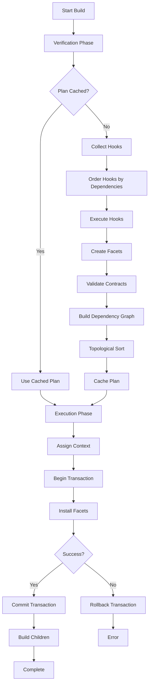
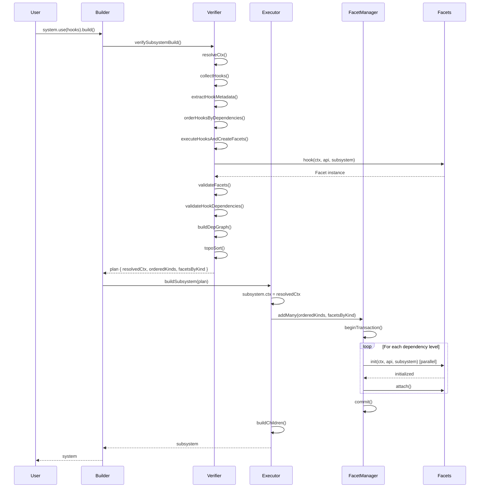

# Build Process

## Overview

The Mycelia Plugin System uses a **two-phase build process** to safely and efficiently install plugins (facets) into a system. This design separates **verification** (pure, side-effect-free) from **execution** (transactional, with side effects), enabling features like plan caching, dry-run validation, and safe rollback.

## Two-Phase Architecture

The build process consists of two distinct phases:

1. **Verification Phase** (`verifySubsystemBuild`) - Pure, deterministic, side-effect-free
   - Collects and orders hooks
   - Creates facets (but doesn't install them)
   - Validates contracts
   - Builds dependency graph
   - Performs topological sort
   - Can be cached and reused

2. **Execution Phase** (`buildSubsystem`) - Transactional, with side effects
   - Assigns resolved context
   - Installs facets atomically
   - Initializes facets in dependency order
   - Attaches facets to system
   - Builds child subsystems
   - Can rollback on failure

## Build Process Flow

### High-Level Flow Diagram



### ASCII Flow Diagram

```
┌─────────────────────────────────────────────────────────────┐
│                    BUILD PROCESS                            │
└─────────────────────────────────────────────────────────────┘
                              │
                              ▼
                    ┌─────────────────┐
                    │ Verification    │
                    │ Phase (Pure)    │
                    └─────────────────┘
                              │
        ┌─────────────────────┼─────────────────────┐
        │                     │                     │
        ▼                     ▼                     ▼
  ┌──────────┐        ┌──────────┐        ┌──────────┐
  │ Collect  │  ───▶  │  Order   │  ───▶  │ Execute  │
  │  Hooks   │        │  Hooks   │        │  Hooks   │
  └──────────┘        └──────────┘        └──────────┘
                              │
        ┌─────────────────────┼─────────────────────┐
        │                     │                     │
        ▼                     ▼                     ▼
  ┌──────────┐        ┌──────────┐        ┌──────────┐
  │ Create   │  ───▶  │ Validate │  ───▶  │  Build   │
  │ Facets   │        │Contracts │        │  Graph   │
  └──────────┘        └──────────┘        └──────────┘
                              │
                              ▼
                    ┌──────────┐
                    │ TopoSort │
                    └──────────┘
                              │
                              ▼
                    ┌─────────────────┐
                    │ Execution       │
                    │ Phase (Tx)      │
                    └─────────────────┘
                              │
        ┌─────────────────────┼─────────────────────┐
        │                     │                     │
        ▼                     ▼                     ▼
  ┌──────────┐        ┌──────────┐        ┌──────────┐
  │ Assign   │  ───▶  │ Install  │  ───▶  │  Build   │
  │ Context  │        │ Facets   │        │ Children │
  └──────────┘        └──────────┘        └──────────┘
```

## Verification Phase (Pure)

The verification phase is **pure** - it has no side effects and produces deterministic results. This allows it to be cached, tested independently, and run multiple times safely.

### Step 1: Context Resolution

The build process starts by resolving the context object, which combines:
- Base context from `subsystem.ctx`
- Additional context from `builder.withCtx()`
- Deep merge for `config` objects
- Shallow merge for other properties

```javascript
// In verifySubsystemBuild()
const resolvedCtx = resolveCtx(subsystem, ctx);
// Result: { ms, config, debug, graphCache? }
```

**See Also:** [Context Resolver](./BUILDER-COMPONENTS.md#context-resolver) for details on merging strategy.

### Step 2: Hook Collection

Hooks are collected from two sources:
1. **Default hooks** - From `subsystem.defaultHooks` (can be array or object with `list()` method)
2. **User hooks** - From `subsystem.hooks` (array)

```javascript
const defaults = Array.isArray(subsystem.defaultHooks)
  ? subsystem.defaultHooks
  : (subsystem.defaultHooks?.list?.() || []);

const user = Array.isArray(subsystem.hooks) ? subsystem.hooks : [];
const hooks = [...defaults, ...user];
```

### Step 3: Hook Metadata Extraction

Each hook's metadata is extracted:
- `kind` - Facet kind identifier
- `required` - Array of required dependencies
- `source` - Source file/URL
- `overwrite` - Whether hook allows overwriting
- `version` - Hook version

```javascript
const hooksByKind = extractHookMetadata(hooks);
// Result: { 'database': [{ hook, required, source, overwrite, version, index }], ... }
```

**See Also:** [Hook Processor](./BUILDER-COMPONENTS.md#hook-processor) for metadata extraction details.

### Step 4: Hook Ordering

Hooks are ordered using topological sort based on their dependencies:

```javascript
const orderedHooks = orderHooksByDependencies(hooks);
```

**Key Features:**
- Hooks with no dependencies execute first
- Dependencies are satisfied before dependents
- Overwrite hooks depend on previous hooks of the same kind
- Multiple hooks per kind are handled with unique IDs

**See Also:** [Hook Processor](./BUILDER-COMPONENTS.md#hook-processor) for ordering algorithm details.

### Step 5: Hook Execution and Facet Creation

Hooks are executed in dependency order, creating facets:

```javascript
const { facetsByKind } = executeHooksAndCreateFacets(
  orderedHooks, 
  resolvedCtx, 
  subsystem, 
  hooksByKind
);
```

**Process:**
1. Execute each hook with `(resolvedCtx, subsystem.api, subsystem)`
2. Verify hook returns a `Facet` instance
3. Verify hook `kind` matches facet `kind`
4. Handle overwrite permissions
5. Temporarily register facets in `api.__facets` (for later hook access)

**Important:** Facets are created but **not initialized or attached** at this stage.

**See Also:** [Hook Processor](./BUILDER-COMPONENTS.md#hook-processor) for execution details.

### Step 6: Contract Validation

Facets are validated against their contracts:

```javascript
validateFacets(facetsByKind, resolvedCtx, subsystem, defaultContractRegistry);
```

**Process:**
1. For each facet with a contract:
   - Check contract exists in registry
   - Enforce contract (methods, properties, custom validation)
2. Throw error immediately if validation fails

**See Also:** [Facet Validator](./BUILDER-COMPONENTS.md#facet-validator) for validation details.

### Step 7: Hook Dependency Validation

Hook `required` dependencies are validated:

```javascript
validateHookDependencies(hooksByKind, facetsByKind, subsystem);
```

**Process:**
1. For each hook's `required` dependencies:
   - Check facet exists in `facetsByKind`
   - Handle overwrite hooks requiring their own kind
2. Throw error if dependency is missing

### Step 8: Dependency Graph Building

A dependency graph is built from:
- Hook `required` dependencies
- Facet `getDependencies()` results

```javascript
const graph = buildDepGraph(hooksByKind, facetsByKind, subsystem);
// Result: { graph: Map<kind, Set<dependents>>, indeg: Map<kind, number>, kinds: string[] }
```

**See Also:** [Dependency Graph](./BUILDER-COMPONENTS.md#dependency-graph) for graph building details.

### Step 9: Topological Sort

Facets are sorted topologically to determine installation order:

```javascript
const cacheKey = graphCache ? createCacheKey(kinds) : null;
const orderedKinds = topoSort(graph, graphCache, cacheKey);
```

**Process:**
1. Check cache if `graphCache` provided
2. If cached and valid, return cached result
3. Otherwise, perform Kahn's algorithm topological sort
4. Cache result (valid or error)
5. Throw error if cycle detected

**See Also:** [Dependency Graph](./BUILDER-COMPONENTS.md#dependency-graph) for sorting algorithm details.

### Step 10: Plan Creation

The verification phase returns a **build plan**:

```javascript
return {
  resolvedCtx,      // Resolved context object
  orderedKinds,     // Topologically sorted facet kinds
  facetsByKind,     // Map of kind → Facet instance
  graphCache        // Updated cache (if provided)
};
```

**See Also:** [Data Structures](./DATA-STRUCTURES.md#plan-structure) for plan structure details.

## Execution Phase (Transactional)

The execution phase is **transactional** - it has side effects and can rollback on failure.

### Step 1: Plan Validation

The plan is validated for consistency:

```javascript
if (!plan) throw new Error('buildSubsystem: invalid plan');
const { resolvedCtx, orderedKinds, facetsByKind } = plan;
// Validate structure...
```

### Step 2: Context Assignment

The resolved context is assigned to the subsystem:

```javascript
subsystem.ctx = resolvedCtx;
```

This makes the context available to all facets during initialization.

### Step 3: Facet Separation

Facets are separated into new and overwrite categories:

```javascript
for (const kind of orderedKinds) {
  const facet = facetsByKind[kind];
  const existingFacet = subsystem.api.__facets.find(kind);
  
  if (!existingFacet) {
    // New facet
    facetsToAdd[kind] = facet;
    kindsToAdd.push(kind);
  } else if (facet.shouldOverwrite?.() === true) {
    // Overwrite facet
    facetsToOverwrite[kind] = facet;
    kindsToOverwrite.push(kind);
  }
  // Otherwise, skip (keep existing)
}
```

### Step 4: Overwrite Facet Removal

Existing facets that will be overwritten are removed first:

```javascript
for (const kind of kindsToOverwrite) {
  subsystem.api.__facets.remove(kind);
  // Also remove from subsystem property if attached
  if (kind in subsystem) {
    delete subsystem[kind];
  }
}
```

### Step 5: Facet Installation

All facets (new + overwritten) are installed atomically:

```javascript
await subsystem.api.__facets.addMany(allKinds, allFacets, {
  init: true,
  attach: true,
  ctx: resolvedCtx,
  api: subsystem.api
});
```

**Process:**
1. Begin transaction
2. Group facets by dependency level
3. For each level:
   - Register all facets
   - Initialize all facets in parallel
   - Attach facets (if `attach: true`)
4. Commit transaction on success
5. Rollback on any failure

**Key Features:**
- **Atomic**: All facets installed or none
- **Parallel**: Facets at same dependency level initialize in parallel
- **Ordered**: Facets initialize in dependency order
- **Transactional**: Automatic rollback on failure

**See Also:** [Facet Manager](../core-concepts/FACET-MANAGER.md) for installation details.

### Step 6: Child Subsystem Building

Child subsystems are built recursively:

```javascript
await buildChildren(subsystem);
```

This ensures the entire subsystem hierarchy is built.

## Builder API Usage

The `SubsystemBuilder` class provides a fluent API for building systems:

### Basic Usage

```javascript
import { StandalonePluginSystem } from 'mycelia-kernel-plugin-system';

const system = new StandalonePluginSystem('my-app', {
  config: { database: { host: 'localhost' } }
});

system
  .use(useDatabase)
  .use(useCache)
  .build();
```

### Context Management

```javascript
system
  .use(useDatabase)
  .withCtx({ config: { database: { port: 5432 } } })
  .build();
```

Context is merged with existing context (deep merge for `config`).

### Plan Creation (Dry Run)

Create a plan without executing:

```javascript
const builder = system._builder;
builder
  .use(useDatabase)
  .use(useCache)
  .plan();

const plan = builder.getPlan();
console.log('Facets to install:', plan.orderedKinds);
// ['database', 'cache']
```

### Plan Caching

Plans are cached when context hasn't changed:

```javascript
// First call - creates plan
builder.plan();

// Second call - uses cached plan (context unchanged)
builder.plan();

// Context changed - creates new plan
builder.withCtx({ config: { database: { port: 5433 } } });
builder.plan(); // New plan created
```

### Cache Invalidation

Manually invalidate cached plan:

```javascript
builder.invalidate();
builder.plan(); // Creates new plan
```

### Graph Cache Reuse

Reuse dependency graph cache across builds:

```javascript
import { DependencyGraphCache } from 'mycelia-kernel-plugin-system';

const graphCache = new DependencyGraphCache(100);

// First build
system1.use(useDatabase).build(graphCache);

// Second build (reuses graph cache)
system2.use(useDatabase).build(graphCache);
```

**See Also:** [Performance](./PERFORMANCE.md) for caching strategies.

## Error Handling

### Verification Phase Errors

Errors in verification phase are thrown immediately:

**Dependency Cycle:**
```
Error: Facet dependency cycle detected among: database, cache, logger
```

**Missing Dependency:**
```
Error: Hook 'cache' (from file:///path/to/hook.js) requires missing facet 'database'.
```

**Contract Validation Failure:**
```
Error: Facet 'database' (from file:///path/to/hook.js) failed contract validation for 'database': FacetContract 'database': facet is missing required methods: query
```

**Duplicate Facet:**
```
Error: Duplicate facet kind 'database' from [file:///path1.js] and [file:///path2.js]. Neither hook nor facet allows overwrite.
```

### Execution Phase Errors

Errors in execution phase trigger automatic rollback:

**Initialization Failure:**
```javascript
// If any facet fails to initialize:
// 1. All facets in transaction are disposed
// 2. All facets are removed from registry
// 3. Error is rethrown
```

**Transaction Rollback:**
```javascript
// In FacetManager.addMany()
try {
  // Install facets...
} catch (err) {
  await this.rollback(); // Automatic rollback
  throw err;
}
```

**See Also:** [Troubleshooting](./TROUBLESHOOTING.md) for common errors and solutions.

## Build Process Sequence

### Sequence Diagram



## Key Design Principles

### 1. Separation of Concerns

- **Verification** is pure and deterministic
- **Execution** is transactional and side-effectful
- Clear boundary between phases

### 2. Fail-Fast

- Errors detected in verification phase (before installation)
- No partial system state
- Clear error messages

### 3. Atomicity

- All facets installed or none
- Transactional rollback on failure
- No orphaned facets

### 4. Performance

- Plan caching for repeated builds
- Dependency graph caching
- Parallel initialization of independent facets

### 5. Flexibility

- Dry-run capability (`plan()`)
- Context merging
- Overwrite support
- Child subsystem building

## See Also

- [Builder Components](./BUILDER-COMPONENTS.md) - Detailed implementation of each component
- [Data Structures](./DATA-STRUCTURES.md) - Internal data structure definitions
- [Performance](./PERFORMANCE.md) - Performance optimization strategies
- [Troubleshooting](./TROUBLESHOOTING.md) - Common issues and debugging
- [Facet Manager](../core-concepts/FACET-MANAGER.md) - Facet installation details
- [Hooks and Facets Overview](../core-concepts/HOOKS-AND-FACETS-OVERVIEW.md) - Core concepts

