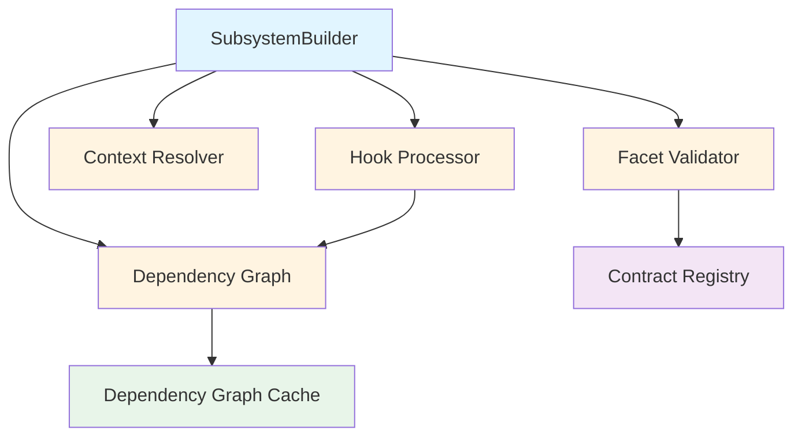
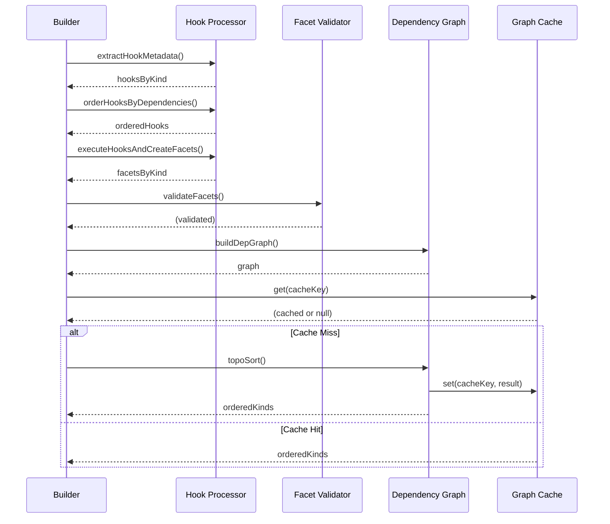

# Builder Components

## Overview

The builder system consists of six core components that work together to verify and build plugin systems. This document provides detailed implementation documentation for each component.

## Component Relationships



## SubsystemBuilder

The `SubsystemBuilder` class is the main orchestrator for the build process. It provides a fluent API for configuring context, creating build plans, and executing builds.

### Public API

#### `constructor(subsystem)`

Creates a new builder instance for the given subsystem.

```javascript
const builder = new SubsystemBuilder(subsystem);
```

**Parameters:**
- `subsystem` (BaseSubsystem/StandalonePluginSystem, required) - The subsystem to build

**Throws:**
- `Error` if subsystem is not provided

#### `withCtx(ctx)`

Merges additional context with existing context. Returns `this` for method chaining.

```javascript
builder.withCtx({ config: { database: { port: 5432 } } });
```

**Parameters:**
- `ctx` (object, optional) - Additional context to merge

**Merging Strategy:**
- **Shallow merge** for most properties (last value wins)
- **Deep merge** for `config` objects (nested properties merged)

**Returns:** `SubsystemBuilder` - Returns `this` for chaining

**Example:**
```javascript
builder
  .withCtx({ config: { database: { host: 'localhost' } } })
  .withCtx({ config: { database: { port: 5432 } } })
  // Result: { config: { database: { host: 'localhost', port: 5432 } } }
```

#### `clearCtx()`

Clears all accumulated context and invalidates cached plan.

```javascript
builder.clearCtx();
```

**Returns:** `SubsystemBuilder` - Returns `this` for chaining

#### `plan(graphCache)`

Creates or retrieves a cached build plan. This is a **dry-run** operation - no facets are installed.

```javascript
builder.plan(graphCache);
```

**Parameters:**
- `graphCache` (DependencyGraphCache, optional) - Optional cache for dependency graph results

**Process:**
1. Check if cached plan exists and context hasn't changed
2. If cached, return cached plan
3. Otherwise, call `verifySubsystemBuild()` to create new plan
4. Cache the plan for future use

**Returns:** `SubsystemBuilder` - Returns `this` for chaining

**Example:**
```javascript
// Create plan
builder.plan();

// Get plan
const plan = builder.getPlan();
console.log('Facets to install:', plan.orderedKinds);
```

#### `dryRun(graphCache)`

Alias for `plan()`. Creates a build plan without executing.

```javascript
builder.dryRun(graphCache);
```

#### `getPlan()`

Retrieves the current build plan (or `null` if no plan exists).

```javascript
const plan = builder.getPlan();
```

**Returns:** `Object | null` - Build plan or `null`

**Plan Structure:**
```javascript
{
  resolvedCtx: { ms, config, debug, graphCache? },
  orderedKinds: string[],
  facetsByKind: { [kind: string]: Facet },
  graphCache?: DependencyGraphCache
}
```

**See Also:** [Data Structures](./DATA-STRUCTURES.md#plan-structure) for detailed structure.

#### `getGraphCache()`

Retrieves the graph cache used in the last plan creation.

```javascript
const graphCache = builder.getGraphCache();
```

**Returns:** `DependencyGraphCache | null` - Graph cache or `null`

#### `invalidate()`

Invalidates the cached plan, forcing a new plan to be created on next `plan()` call.

```javascript
builder.invalidate();
```

**Returns:** `SubsystemBuilder` - Returns `this` for chaining

#### `build(graphCache)`

Creates a plan (if needed) and executes the build. This is the main method for building systems.

```javascript
await builder.build(graphCache);
```

**Parameters:**
- `graphCache` (DependencyGraphCache, optional) - Optional cache for dependency graph results

**Process:**
1. Call `plan()` to create or retrieve cached plan
2. Call `buildSubsystem()` to execute the plan
3. Return the built subsystem

**Returns:** `Promise<BaseSubsystem>` - The built subsystem

**Example:**
```javascript
const system = await builder
  .use(useDatabase)
  .use(useCache)
  .build();
```

### Context Management

The builder maintains context internally and merges it with subsystem context during plan creation:

```javascript
// Internal context (from withCtx())
this.#ctx = { config: { database: { host: 'localhost' } } };

// Merged with subsystem.ctx during verifySubsystemBuild()
const resolvedCtx = resolveCtx(subsystem, this.#ctx);
```

**See Also:** [Context Resolver](#context-resolver) for merging details.

### Plan Caching

Plans are cached when:
- Context hasn't changed (hash comparison)
- Same graph cache is used

```javascript
// Hash context for comparison
const currentCtxHash = this.#hashCtx(this.#ctx);

// Use cached plan if context unchanged
if (this.#plan && this.#lastCtxHash === currentCtxHash) {
  return this; // Use cached plan
}
```

**See Also:** [Performance](./PERFORMANCE.md#plan-caching) for caching strategies.

---

## Hook Processor

The hook processor handles hook metadata extraction, dependency-based ordering, and hook execution.

### Functions

#### `extractHookMetadata(hooks)`

Extracts metadata from an array of hooks, organizing them by kind.

**Signature:**
```javascript
extractHookMetadata(hooks: Function[]): Object
```

**Parameters:**
- `hooks` (Array<Function>, required) - Array of hook functions

**Returns:**
- `Object` - Object mapping hook kinds to arrays of hook metadata

**Structure:**
```javascript
{
  'database': [
    { hook, required, source, overwrite, version, index: 0 }
  ],
  'cache': [
    { hook, required, source, overwrite, version, index: 0 },
    { hook, required, source, overwrite, version, index: 1 } // Overwrite hook
  ]
}
```

**Key Features:**
- **Multiple hooks per kind**: Stored as arrays to support overwrite hooks
- **Registration order**: Maintained via `index` property
- **Metadata extraction**: Extracts `kind`, `required`, `source`, `overwrite`, `version`

**Example:**
```javascript
const hooks = [useDatabase, useCache, useCacheOverwrite];
const hooksByKind = extractHookMetadata(hooks);
// {
//   'database': [{ hook: useDatabase, required: [], source: '...', overwrite: false, version: '1.0.0', index: 0 }],
//   'cache': [
//     { hook: useCache, required: ['database'], source: '...', overwrite: false, version: '1.0.0', index: 0 },
//     { hook: useCacheOverwrite, required: ['cache'], source: '...', overwrite: true, version: '2.0.0', index: 1 }
//   ]
// }
```

#### `orderHooksByDependencies(hooks)`

Orders hooks using topological sort based on their dependencies.

**Signature:**
```javascript
orderHooksByDependencies(hooks: Function[]): Function[]
```

**Parameters:**
- `hooks` (Array<Function>, required) - Array of hook functions

**Returns:**
- `Array<Function>` - Ordered array of hooks

**Algorithm:**
1. Extract hook metadata and assign unique IDs (`kind:index`)
2. Build dependency graph using hook IDs
3. Handle overwrite hooks (depend on previous hook of same kind)
4. Perform topological sort on hook IDs
5. Return ordered hooks

**Dependency Rules:**
- Hook depends on hooks that create its `required` facets
- Overwrite hooks depend on previous hooks of the same kind
- Dependencies point to the **last** hook that creates a kind (most recent version)

**Example:**
```javascript
// Hooks: useDatabase, useCache (requires 'database'), useLogger
const ordered = orderHooksByDependencies([useLogger, useCache, useDatabase]);
// Result: [useDatabase, useCache, useLogger]
// (database first, then cache depends on database, logger has no deps)
```

**See Also:** [Dependency Graph](#dependency-graph) for topological sort algorithm.

#### `executeHooksAndCreateFacets(orderedHooks, resolvedCtx, subsystem, hooksByKind)`

Executes hooks in order and creates facets.

**Signature:**
```javascript
executeHooksAndCreateFacets(
  orderedHooks: Function[],
  resolvedCtx: Object,
  subsystem: BaseSubsystem,
  hooksByKind: Object
): { facetsByKind: Object }
```

**Parameters:**
- `orderedHooks` (Array<Function>, required) - Ordered array of hooks to execute
- `resolvedCtx` (Object, required) - Resolved context object
- `subsystem` (BaseSubsystem, required) - Subsystem instance
- `hooksByKind` (Object, required) - Hook metadata by kind

**Returns:**
- `Object` - Object with `facetsByKind` property

**Process:**
1. Execute each hook with `(resolvedCtx, subsystem.api, subsystem)`
2. Verify hook returns a `Facet` instance
3. Verify hook `kind` matches facet `kind`
4. Check overwrite permissions
5. Temporarily register facets in `api.__facets` (for later hook access)
6. Return `facetsByKind` map

**Validation:**
- Hook must return a `Facet` instance
- Hook `kind` must match facet `kind`
- Overwrite permission checked (hook `overwrite` or facet `shouldOverwrite()`)

**Temporary Registration:**
Facets are temporarily registered in `api.__facets` during verification so later hooks can access them:

```javascript
// Make facet available for later hooks
subsystem.api.__facets[facetKind] = facet;
```

**Important:** This is temporary - facets are not initialized or attached until execution phase.

#### `validateHookDependencies(hooksByKind, facetsByKind, subsystem)`

Validates that all hook `required` dependencies exist.

**Signature:**
```javascript
validateHookDependencies(
  hooksByKind: Object,
  facetsByKind: Object,
  subsystem: BaseSubsystem
): void
```

**Parameters:**
- `hooksByKind` (Object, required) - Hook metadata by kind
- `facetsByKind` (Object, required) - Facets by kind
- `subsystem` (BaseSubsystem, optional) - Subsystem instance

**Throws:**
- `Error` if a required dependency is missing

**Validation Rules:**
- For each hook's `required` dependencies:
  - Check facet exists in `facetsByKind`
  - Handle overwrite hooks requiring their own kind (must have previous hook)
- Throw error immediately if dependency missing

**Example:**
```javascript
// Hook requires 'database' but no database facet created
// Error: Hook 'cache' (from file:///path/to/hook.js) requires missing facet 'database'.
```

---

## Dependency Graph

The dependency graph component builds dependency graphs and performs topological sorting.

### Functions

#### `buildDepGraph(hooksByKind, facetsByKind, subsystem)`

Builds a dependency graph from hook and facet dependencies.

**Signature:**
```javascript
buildDepGraph(
  hooksByKind: Object,
  facetsByKind: Object,
  subsystem: BaseSubsystem
): { graph: Map, indeg: Map, kinds: string[] }
```

**Parameters:**
- `hooksByKind` (Object, required) - Hook metadata by kind
- `facetsByKind` (Object, required) - Facets by kind
- `subsystem` (BaseSubsystem, optional) - Subsystem instance

**Returns:**
- `Object` - Dependency graph with `graph`, `indeg`, and `kinds`

**Graph Structure:**
```javascript
{
  graph: Map<kind, Set<dependentKinds>>,  // dep → Set(dependents)
  indeg: Map<kind, number>,              // kind → indegree
  kinds: string[]                        // All facet kinds
}
```

**Process:**
1. Initialize graph and indegree maps for all kinds
2. Add dependencies from hook `required` arrays:
   - Skip self-dependency for overwrite hooks (no cycle)
   - Add edge: `dep → kind` (dependency points to dependent)
3. Add dependencies from facet `getDependencies()`:
   - Add edge: `dep → kind`
4. Return graph structure

**Dependency Sources:**
- **Hook dependencies**: From `hook.required` array
- **Facet dependencies**: From `facet.getDependencies()` method

**Example:**
```javascript
// Hooks: database (no deps), cache (requires 'database'), logger (no deps)
// Graph:
// {
//   graph: Map {
//     'database' => Set(['cache']),
//     'cache' => Set([]),
//     'logger' => Set([])
//   },
//   indeg: Map {
//     'database' => 0,
//     'cache' => 1,
//     'logger' => 0
//   },
//   kinds: ['database', 'cache', 'logger']
// }
```

**See Also:** [Data Structures](./DATA-STRUCTURES.md#dependency-graph-structure) for graph structure details.

#### `topoSort(graphData, graphCache, cacheKey)`

Performs topological sort using Kahn's algorithm with caching support.

**Signature:**
```javascript
topoSort(
  graphData: { graph: Map, indeg: Map, kinds: string[] },
  graphCache: DependencyGraphCache,
  cacheKey: string
): string[]
```

**Parameters:**
- `graphData` (Object, required) - Dependency graph data
- `graphCache` (DependencyGraphCache, optional) - Optional cache
- `cacheKey` (string, optional) - Cache key

**Returns:**
- `Array<string>` - Topologically sorted array of facet kinds

**Throws:**
- `Error` if dependency cycle detected

**Algorithm (Kahn's):**
1. Check cache if provided
2. Initialize queue with nodes having indegree 0
3. While queue not empty:
   - Remove node from queue
   - Add to ordered list
   - Decrement indegree of dependents
   - Add dependents with indegree 0 to queue
4. If ordered length ≠ total kinds, cycle detected
5. Cache result (valid or error)
6. Return ordered list

**Cycle Detection:**
```javascript
if (ordered.length !== kinds.length) {
  const stuck = kinds.filter(k => (indeg.get(k) || 0) > 0);
  throw new Error(`Facet dependency cycle detected among: ${stuck.join(', ')}`);
}
```

**Caching:**
- Valid results cached with `{ valid: true, orderedKinds: [...] }`
- Invalid results (cycles) cached with `{ valid: false, error: '...' }`

**Example:**
```javascript
// Graph: database → cache → logger
const ordered = topoSort(graph, cache, 'database,cache,logger');
// Result: ['database', 'cache', 'logger']
```

**See Also:** [Dependency Graph Cache](#dependency-graph-cache) for caching details.

#### `createCacheKey(kinds)`

Creates a cache key from sorted facet kinds.

**Signature:**
```javascript
createCacheKey(kinds: string[]): string
```

**Parameters:**
- `kinds` (Array<string>, required) - Array of facet kinds

**Returns:**
- `string` - Cache key (sorted, comma-separated)

**Example:**
```javascript
createCacheKey(['cache', 'database', 'logger']);
// Result: 'cache,database,logger'
```

**Note:** Keys are sorted for consistency regardless of input order.

---

## Context Resolver

The context resolver handles context merging and resolution.

### Functions

#### `resolveCtx(subsystem, ctx)`

Resolves context by merging subsystem context with additional context.

**Signature:**
```javascript
resolveCtx(subsystem: BaseSubsystem, ctx: Object): Object
```

**Parameters:**
- `subsystem` (BaseSubsystem, required) - Subsystem instance
- `ctx` (Object, required) - Additional context to merge

**Returns:**
- `Object` - Resolved context object

**Merging Strategy:**
- **Shallow merge** for most properties (last value wins)
- **Deep merge** for `config` objects (nested properties merged)

**Process:**
1. Get base context from `subsystem.ctx`
2. Shallow merge with `ctx`
3. Deep merge `config` objects if both exist

**Example:**
```javascript
// subsystem.ctx = { config: { database: { host: 'localhost' } }, debug: false }
// ctx = { config: { database: { port: 5432 } }, debug: true }
// Result: { config: { database: { host: 'localhost', port: 5432 } }, debug: true }
```

#### `deepMerge(target, source)`

Deep merges two objects, only merging plain objects (not arrays or other types).

**Signature:**
```javascript
deepMerge(target: Object, source: Object): Object
```

**Parameters:**
- `target` (Object, required) - Target object
- `source` (Object, required) - Source object

**Returns:**
- `Object` - Merged object

**Merging Rules:**
- **Plain objects**: Recursively merged
- **Arrays**: Replaced (not merged)
- **Other types**: Replaced (not merged)
- **Null/undefined**: Handled safely

**Example:**
```javascript
deepMerge(
  { config: { database: { host: 'localhost' } } },
  { config: { database: { port: 5432 } } }
);
// Result: { config: { database: { host: 'localhost', port: 5432 } } }
```

---

## Facet Validator

The facet validator enforces facet contracts during verification.

### Functions

#### `validateFacets(facetsByKind, resolvedCtx, subsystem, contractRegistry)`

Validates all facets against their contracts.

**Signature:**
```javascript
validateFacets(
  facetsByKind: Object,
  resolvedCtx: Object,
  subsystem: BaseSubsystem,
  contractRegistry: FacetContractRegistry
): void
```

**Parameters:**
- `facetsByKind` (Object, required) - Facets by kind
- `resolvedCtx` (Object, required) - Resolved context
- `subsystem` (BaseSubsystem, required) - Subsystem instance
- `contractRegistry` (FacetContractRegistry, required) - Contract registry

**Throws:**
- `Error` if contract not registered
- `Error` if contract validation fails

**Process:**
1. For each facet with a contract:
   - Check contract exists in registry
   - Enforce contract (methods, properties, custom validation)
2. Throw error immediately if validation fails

**Validation Timing:**
- Happens **before** dependency graph building
- Happens **after** facet creation
- Fail-fast: errors thrown immediately

**Example:**
```javascript
// Facet has contract 'database' but missing required method 'query'
// Error: Facet 'database' (from file:///path/to/hook.js) failed contract validation for 'database': FacetContract 'database': facet is missing required methods: query
```

**See Also:** [Facet Contracts](../facet-contracts/FACET-CONTRACTS-OVERVIEW.md) for contract system details.

---

## Dependency Graph Cache

The `DependencyGraphCache` class provides LRU (Least Recently Used) caching for dependency graph topological sort results.

### Class: DependencyGraphCache

#### `constructor(capacity)`

Creates a new cache with specified capacity.

**Signature:**
```javascript
new DependencyGraphCache(capacity?: number)
```

**Parameters:**
- `capacity` (number, optional, default: 100) - Maximum number of cached entries

**Throws:**
- `Error` if capacity is not a positive number

**Example:**
```javascript
const cache = new DependencyGraphCache(100);
```

#### `get(key)`

Retrieves cached result and updates access order (moves to most recently used).

**Signature:**
```javascript
get(key: string): { valid: boolean, orderedKinds?: string[], error?: string } | null
```

**Parameters:**
- `key` (string, required) - Cache key (sorted facet kinds string)

**Returns:**
- `Object | null` - Cached result or `null` if not found

**Cache Entry Structure:**
```javascript
{
  valid: boolean,           // Whether result is valid
  orderedKinds?: string[],  // Topologically sorted kinds (if valid)
  error?: string            // Error message (if invalid)
}
```

**LRU Behavior:**
- Entry is moved to end (most recently used) on access
- Implemented by deleting and re-inserting

**Example:**
```javascript
const result = cache.get('database,cache,logger');
// Result: { valid: true, orderedKinds: ['database', 'cache', 'logger'] }
```

#### `set(key, valid, orderedKinds, error)`

Stores a cached result.

**Signature:**
```javascript
set(
  key: string,
  valid: boolean,
  orderedKinds?: string[],
  error?: string
): void
```

**Parameters:**
- `key` (string, required) - Cache key
- `valid` (boolean, required) - Whether result is valid
- `orderedKinds` (string[], optional) - Sorted kinds (if valid)
- `error` (string, optional) - Error message (if invalid)

**LRU Behavior:**
- If at capacity and key not present, removes least recently used (first entry)
- Entry added to end (most recently used)

**Example:**
```javascript
cache.set('database,cache,logger', true, ['database', 'cache', 'logger']);
```

#### `clear()`

Clears all cached entries.

**Signature:**
```javascript
clear(): void
```

#### `size()`

Gets current cache size.

**Signature:**
```javascript
size(): number
```

**Returns:**
- `number` - Number of cached entries

#### `getStats()`

Gets cache statistics.

**Signature:**
```javascript
getStats(): { capacity: number, size: number, keys: string[] }
```

**Returns:**
- `Object` - Cache statistics

**Example:**
```javascript
const stats = cache.getStats();
// { capacity: 100, size: 5, keys: ['database,cache', 'database,logger', ...] }
```

### Cache Usage

**Reusing Cache Across Builds:**
```javascript
const graphCache = new DependencyGraphCache(100);

// First build
system1.use(useDatabase).use(useCache).build(graphCache);

// Second build (reuses cache)
system2.use(useDatabase).use(useCache).build(graphCache);
```

**Cache Key Generation:**
```javascript
const kinds = ['cache', 'database', 'logger'];
const cacheKey = createCacheKey(kinds); // 'cache,database,logger'
```

**See Also:** [Performance](./PERFORMANCE.md#dependency-graph-caching) for caching strategies.

---

## Component Interaction

### Build Flow



## See Also

- [Build Process](./BUILD-PROCESS.md) - High-level build process overview
- [Data Structures](./DATA-STRUCTURES.md) - Internal data structure definitions
- [Performance](./PERFORMANCE.md) - Performance optimization strategies
- [Troubleshooting](./TROUBLESHOOTING.md) - Common issues and debugging
- [Facet Contracts](../facet-contracts/FACET-CONTRACTS-OVERVIEW.md) - Contract system
- [Facet Manager](../core-concepts/FACET-MANAGER.md) - Facet installation

