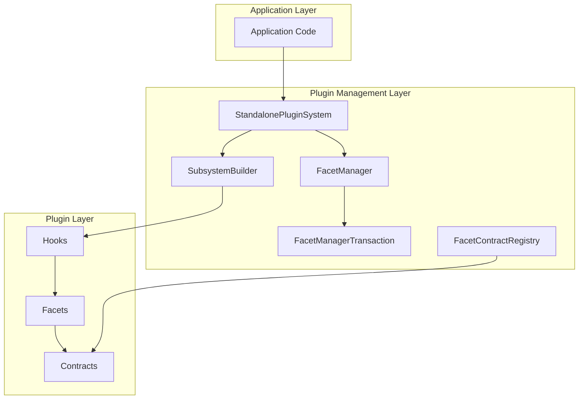
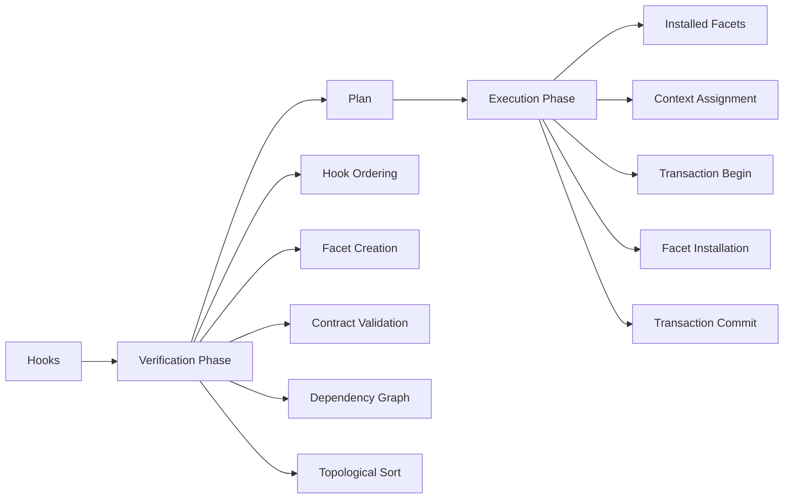

# Plugin System Analysis

## Executive Summary

The **Mycelia Plugin System** is a sophisticated, dependency-aware plugin architecture built on a **Hook-Facet pattern**. It provides:

- **Dependency Injection**: Automatic dependency resolution and initialization order
- **Lifecycle Management**: Built-in initialization and disposal hooks
- **Transaction Safety**: Atomic plugin installation with automatic rollback
- **Composability**: Plugins can depend on and extend each other
- **Standalone Operation**: Fully functional plugin system without external dependencies
- **Contract Validation**: Runtime validation of plugin interfaces

## Core Architecture

### Three-Layer Architecture

```
┌─────────────────────────────────────────────────────────┐
│                    Application Layer                    │
│  (Uses plugins via system.find('plugin-name'))          │
└─────────────────────────────────────────────────────────┘
                          ↓
┌─────────────────────────────────────────────────────────┐
│                   Plugin Management                      │
│  • StandalonePluginSystem / BaseSubsystem              │
│  • SubsystemBuilder (installation orchestrator)         │
│  • FacetManager (plugin registry)                       │
│  • FacetManagerTransaction (atomicity guarantees)       │
│  • FacetContractRegistry (interface validation)          │
└─────────────────────────────────────────────────────────┘
                          ↓
┌─────────────────────────────────────────────────────────┐
│                     Plugin Layer                         │
│  • Hooks (plugin factories)                             │
│  • Facets (plugin instances)                            │
│  • Dependencies (explicit dependency graph)             │
│  • Contracts (interface specifications)                 │
└─────────────────────────────────────────────────────────┘
```

### Key Components

#### 1. **Hooks** - Plugin Factories

Hooks are factory functions that create plugin instances (Facets). They declare dependencies and metadata.

```javascript
import { createHook, Facet } from 'mycelia-kernel-plugin-system';

export const useDatabase = createHook({
  kind: 'database',           // Unique identifier
  required: [],               // Dependencies
  attach: true,               // Auto-attach to system
  source: import.meta.url,    // Source location
  contract: 'database',       // Optional contract validation
  version: '1.0.0',           // Plugin version
  fn: (ctx, api, subsystem) => {
    // Create and return a Facet
    return new Facet('database', { 
      attach: true, 
      source: import.meta.url 
    })
      .add({
        async query(sql) { /* implementation */ },
        async close() { /* cleanup */ }
      })
      .onInit(async ({ ctx }) => {
        // Initialize resources
      })
      .onDispose(async () => {
        // Cleanup resources
      });
  }
});
```

#### 2. **Facets** - Plugin Instances

Facets are composable units of functionality that extend system capabilities.

```javascript
const facet = new Facet('cache', {
  attach: true,              // Make available via system.find()
  required: ['database'],    // Declare dependencies
  source: import.meta.url,   // Source tracking
  contract: 'cache',         // Optional contract
  version: '1.0.0'           // Facet version
})
.add({
  // Public API methods
  get(key) { /* ... */ },
  set(key, value) { /* ... */ }
})
.onInit(async ({ ctx, api, subsystem }) => {
  // Initialize plugin
})
.onDispose(async () => {
  // Clean up plugin
});
```

#### 3. **FacetManager** - Plugin Registry

Manages plugin storage, retrieval, and lifecycle. Provides transaction support for atomic installations.

**Key Features:**
- Map-based storage for efficient lookups
- Proxy pattern for transparent access
- Transaction support for atomic operations
- Multiple facets per kind support

#### 4. **SubsystemBuilder** - Installation Orchestrator

Handles dependency resolution, initialization order, and builds the complete system.

**Key Features:**
- Two-phase build (verify/execute)
- Plan caching for performance
- Context management
- Dependency graph caching

#### 5. **FacetContractRegistry** - Interface Validation

Manages facet contracts and enforces interface validation.

**Key Features:**
- Contract registration and lookup
- Runtime validation
- Custom validation functions
- Pre-registered standard contracts

## Design Principles

### 1. Separation of Concerns

**Verification vs Execution:**
- **Verification**: Pure, deterministic, side-effect-free
- **Execution**: Transactional, with side effects, can rollback

This separation enables:
- Plan caching
- Dry-run validation
- Safe testing
- Performance optimization

### 2. Dependency-Aware Architecture

**Explicit Dependencies:**
- Dependencies declared in hook metadata
- Automatic topological sorting
- Cycle detection
- Parallel initialization of independent plugins

**Benefits:**
- Correct initialization order
- Early error detection
- Better performance through parallelization

### 3. Transaction Safety

**Atomic Operations:**
- All plugins installed or none
- Automatic rollback on failure
- No partial system state
- Clean error recovery

**Benefits:**
- System integrity
- Predictable failure behavior
- Easier debugging

### 4. Lifecycle Management

**Explicit Lifecycle:**
- `onInit`: Resource acquisition
- `onDispose`: Resource cleanup
- Automatic disposal on rollback
- Hierarchical lifecycle support

**Benefits:**
- Proper resource management
- No memory leaks
- Clean shutdown

### 5. Contract-Based Validation

**Interface Contracts:**
- Required methods validation
- Required properties validation
- Custom validation functions
- Adapter pattern support

**Benefits:**
- Early error detection
- Interface guarantees
- Swappable implementations

## Architectural Patterns

### Hook-Facet Pattern

**Pattern:** Factory functions (Hooks) create instances (Facets) with metadata.

**Benefits:**
- Encapsulation via closures
- Metadata-driven behavior
- Composable design
- Clear separation of factory and instance

**Example:**
```javascript
// Hook (factory)
export const useDatabase = createHook({
  kind: 'database',
  fn: (ctx, api, subsystem) => {
    // Factory logic with closure
    const config = ctx.config?.database || {};
    
    // Create Facet (instance)
    return new Facet('database', { attach: true })
      .add({ /* methods */ });
  }
});
```

### Builder Pattern

**Pattern:** Fluent API for constructing systems.

**Benefits:**
- Readable configuration
- Method chaining
- Incremental building
- Plan caching

**Example:**
```javascript
system
  .use(useDatabase)
  .withCtx({ config: { database: { port: 5432 } } })
  .use(useCache)
  .build();
```

### Dependency Injection Pattern

**Pattern:** Dependencies injected via context and API.

**Benefits:**
- Loose coupling
- Testability
- Flexibility
- Clear dependencies

**Example:**
```javascript
fn: (ctx, api, subsystem) => {
  // Dependencies injected
  const database = api.__facets.database;  // Required
  const logger = subsystem.find('logger');  // Optional
}
```

### Adapter Pattern

**Pattern:** Multiple implementations of same contract.

**Benefits:**
- Swappable implementations
- Interface consistency
- Flexibility
- Testing support

**Example:**
```javascript
// Standard implementation
export const usePostgreSQL = createHook({
  kind: 'database',
  contract: 'database',
  // ...
});

// Alternative implementation
export const useMySQL = createHook({
  kind: 'mysql-database',
  contract: 'database',  // Same contract
  // ...
});
```

### Transaction Pattern

**Pattern:** Atomic operations with rollback.

**Benefits:**
- System integrity
- Predictable failures
- Clean error recovery

**Example:**
```javascript
// Automatic transaction in addMany()
facetManager.beginTransaction();
try {
  // Install facets...
  facetManager.commit();
} catch (error) {
  await facetManager.rollback(); // Automatic
  throw error;
}
```

## Comparison to Similar Systems

### 1. **WordPress Plugin System**

**Similarities:**
- Hook-based extensibility
- Plugin discovery and loading
- Configuration-driven

**Differences:**

| Feature | Mycelia Plugin System | WordPress |
|---------|----------------------|-----------|
| **Dependency Management** | Explicit, automatic resolution | Manual, via plugin headers |
| **Lifecycle** | Built-in onInit/onDispose | Manual register/deregister |
| **Transaction Safety** | Atomic installation with rollback | No transaction support |
| **Type Safety** | JavaScript/TypeScript contracts | PHP, limited type safety |
| **Architecture** | Facet-based composition | Action/Filter hooks |
| **Standalone** | Fully standalone | Requires WordPress core |
| **Runtime** | Runtime plugin system | PHP runtime only |

**Verdict:** Mycelia is more structured and dependency-aware; WordPress is simpler but less robust.

---

### 2. **Babel Plugin System**

**Similarities:**
- Plugin composition
- Visitor pattern (similar to facets)
- Build-time transformations

**Differences:**

| Feature | Mycelia Plugin System | Babel |
|---------|----------------------|-------|
| **Domain** | General-purpose plugin system | AST transformation only |
| **Dependencies** | Explicit with auto-resolution | Manual ordering |
| **Runtime** | Runtime plugin system | Build-time only |
| **Lifecycle** | Full lifecycle management | Visit/exit only |
| **State Management** | Facets maintain state | Visitors are stateless |
| **Configuration** | Per-facet configuration | Global plugin options |
| **Transaction Safety** | Atomic with rollback | No transaction support |

**Verdict:** Babel is specialized for AST transformation; Mycelia is general-purpose with richer lifecycle.

---

### 3. **Vite Plugin System**

**Similarities:**
- Hook-based architecture
- Plugin composition and chaining
- Configuration-driven

**Differences:**

| Feature | Mycelia Plugin System | Vite |
|---------|----------------------|------|
| **Dependencies** | Explicit DAG with resolution | Implicit via `enforce` order |
| **Lifecycle** | onInit/onDispose with resources | Build hooks only |
| **Transaction Safety** | Atomic installation | No rollback |
| **Standalone Mode** | Yes, fully standalone | Requires Vite core |
| **Domain** | General-purpose | Build/dev server only |
| **Hot Reload** | `reload()` method | Native HMR support |
| **Runtime** | Runtime plugin system | Build-time only |

**Verdict:** Vite is specialized for build tools; Mycelia is general-purpose with stronger guarantees.

---

### 4. **Rollup Plugin System**

**Similarities:**
- Hook-based plugin architecture
- Plugin composition
- Build lifecycle hooks

**Differences:**

| Feature | Mycelia Plugin System | Rollup |
|---------|----------------------|--------|
| **Dependency Resolution** | Automatic, explicit DAG | Manual ordering |
| **Lifecycle** | Runtime lifecycle management | Build-time hooks only |
| **Transaction Safety** | Atomic with rollback | No transaction support |
| **State** | Facets can hold state | Plugins are mostly functional |
| **Error Handling** | Transaction rollback | Individual plugin errors |
| **Standalone** | Yes | Requires Rollup core |
| **Domain** | General-purpose | Build tool specific |

**Verdict:** Rollup is build-specific; Mycelia provides runtime lifecycle and stronger safety.

---

### 5. **Fastify Plugin System**

**Similarities:**
- Plugin registration with `use()` method
- Dependency injection via context
- Encapsulation boundaries

**Differences:**

| Feature | Mycelia Plugin System | Fastify |
|---------|----------------------|---------|
| **Dependencies** | Explicit DAG with resolution | Implicit via registration order |
| **Lifecycle** | onInit/onDispose | Plugin registration hooks |
| **Transaction Safety** | Atomic with rollback | No transaction support |
| **Encapsulation** | Facets are isolated | Plugins have scope boundaries |
| **Async Init** | Full async/await support | Async plugin registration |
| **Error Handling** | Transaction rollback | Plugin-level error handling |
| **Domain** | General-purpose | HTTP server specific |

**Verdict:** Fastify is HTTP-server specific; Mycelia is more general with explicit dependencies.

---

### 6. **NestJS Modules System**

**Similarities:**
- Dependency injection container
- Module composition with dependencies
- Lifecycle hooks (OnModuleInit, OnModuleDestroy)
- Provider-based architecture (similar to Facets)

**Differences:**

| Feature | Mycelia Plugin System | NestJS |
|---------|----------------------|--------|
| **DI Framework** | Lightweight, hook-based | Full IoC container with decorators |
| **Dependencies** | Explicit in hook metadata | Decorator-based with `@Injectable()` |
| **Lifecycle** | onInit/onDispose | OnModuleInit/OnModuleDestroy/OnApplicationBootstrap |
| **Transaction Safety** | Atomic with rollback | No transaction support |
| **Language** | JavaScript/TypeScript | TypeScript-first |
| **Scope** | General-purpose | Web application framework |
| **Metadata** | Runtime function properties | Reflect.metadata decorators |
| **Standalone** | Yes | Requires NestJS core |

**Verdict:** NestJS is a full framework with decorators; Mycelia is lighter and more functional.

---

### 7. **Eclipse Plugin System (OSGi)**

**Similarities:**
- Explicit dependency declaration
- Lifecycle management (bundle activation/deactivation)
- Service registry (similar to FacetManager)
- Dynamic plugin loading/unloading

**Differences:**

| Feature | Mycelia Plugin System | OSGi/Eclipse |
|---------|----------------------|--------------|
| **Language** | JavaScript | Java |
| **Complexity** | Lightweight | Heavy framework |
| **Classloading** | Single runtime | Separate classloaders per bundle |
| **Versioning** | Basic version support | Semantic versioning support |
| **Dynamic Loading** | Can build/dispose | Full dynamic loading |
| **Registry** | FacetManager (simple) | Service registry (complex) |
| **Standalone** | Yes | Requires OSGi runtime |

**Verdict:** OSGi is enterprise-grade and complex; Mycelia is simpler and JavaScript-native.

---

### 8. **VS Code Extension API**

**Similarities:**
- Lifecycle activation/deactivation
- Contribution points (similar to facets)
- Extension dependencies

**Differences:**

| Feature | Mycelia Plugin System | VS Code |
|---------|----------------------|---------|
| **Dependencies** | Explicit DAG resolution | Extension dependencies via package.json |
| **Activation** | Explicit build() call | Lazy activation on demand |
| **Lifecycle** | onInit/onDispose | activate()/deactivate() |
| **Registry** | FacetManager | Extension host |
| **Isolation** | Shared runtime | Separate processes for extensions |
| **API Surface** | Facet methods | VS Code API namespaces |
| **Domain** | General-purpose | IDE-specific |

**Verdict:** VS Code is process-isolated and IDE-specific; Mycelia is simpler and general-purpose.

---

### 9. **Webpack Plugin System**

**Similarities:**
- Hook-based architecture (tapable hooks)
- Plugin composition
- Build lifecycle hooks

**Differences:**

| Feature | Mycelia Plugin System | Webpack |
|---------|----------------------|---------|
| **Hook System** | Custom hook/facet pattern | Tapable library |
| **Dependencies** | Explicit with resolution | Implicit ordering |
| **Lifecycle** | onInit/onDispose | Compilation hooks (make, emit, etc.) |
| **Transaction Safety** | Atomic with rollback | No transaction support |
| **Domain** | General-purpose | Build tool specific |
| **Async** | Native async/await | Tapable async hooks |
| **Standalone** | Yes | Requires Webpack core |

**Verdict:** Webpack's tapable is powerful but build-specific; Mycelia is general-purpose with cleaner API.

---

### 10. **Express Middleware**

**Similarities:**
- Plugin-like composition
- Request/response handling
- Chain of responsibility

**Differences:**

| Feature | Mycelia Plugin System | Express Middleware |
|---------|----------------------|-------------------|
| **Dependencies** | Explicit DAG resolution | Implicit via registration order |
| **Lifecycle** | Full lifecycle management | Request/response only |
| **Transaction Safety** | Atomic with rollback | No transaction support |
| **Domain** | General-purpose | HTTP request handling |
| **State** | Facets maintain state | Stateless middleware |
| **Standalone** | Yes | Requires Express core |

**Verdict:** Express is HTTP-specific; Mycelia is general-purpose with stronger guarantees.

---

## Unique Features of Mycelia Plugin System

### 1. **Transaction Safety**
Unique among JavaScript plugin systems - atomic installation with automatic rollback on failure.

**Benefits:**
- No partial system state
- Predictable failure behavior
- Clean error recovery

### 2. **Explicit Dependency DAG**
Dependencies are declared in metadata and automatically resolved with topological sorting.

**Benefits:**
- Correct initialization order
- Early cycle detection
- Parallel initialization opportunities

### 3. **Standalone Operation**
Fully functional plugin system without requiring a host application or framework.

**Benefits:**
- No external dependencies
- Can be used in any JavaScript environment
- Framework-agnostic

### 4. **Facet Contracts**
Optional contract validation ensures plugins conform to expected interfaces.

**Benefits:**
- Early error detection
- Interface guarantees
- Adapter pattern support

### 5. **Two-Phase Build**
Separation of verification (pure) and execution (transactional) enables caching and dry-runs.

**Benefits:**
- Plan caching for performance
- Dry-run validation
- Safe testing
- Better error messages

### 6. **Builder Pattern with Fluent API**
```javascript
system
  .use(useDatabase)
  .use(useCache)
  .withCtx({ config: { database: { port: 5432 } } })
  .build();
```

**Benefits:**
- Readable configuration
- Method chaining
- Incremental building

### 7. **Parallel Initialization**
Facets at the same dependency level initialize in parallel for better performance.

**Benefits:**
- Faster builds
- Better resource utilization
- Scalable to large systems

## Strengths

1. **Robust Dependency Management**: Automatic resolution and initialization ordering
2. **Transaction Safety**: All-or-nothing plugin installation with rollback
3. **Clear Lifecycle**: Explicit onInit/onDispose hooks for resource management
4. **Composition**: Plugins can depend on and extend other plugins
5. **Standalone Operation**: Works without external dependencies
6. **Type Safety**: Can use TypeScript contracts for interface validation
7. **Traceability**: Source tracking and debug support built-in
8. **Performance**: Plan caching and parallel initialization
9. **Flexibility**: Adapter pattern for swappable implementations
10. **Error Handling**: Fail-fast with clear error messages

## Weaknesses

1. **Learning Curve**: Hook-Facet pattern requires understanding multiple concepts
2. **No Hot Reload**: Plugins can't be dynamically swapped without rebuild
3. **Limited Versioning**: Basic version support, no semantic versioning resolution
4. **Manual Discovery**: Plugins must be manually imported and registered
5. **Limited Isolation**: Plugins share the same runtime environment
6. **Documentation Complexity**: Rich features require extensive documentation
7. **No Plugin Marketplace**: No built-in plugin discovery or distribution
8. **Memory Overhead**: Plan caching and dependency graphs use memory

## Best Practices

### 1. **Declare All Dependencies**
```javascript
export const useCache = createHook({
  kind: 'cache',
  required: ['database', 'logger'],  // ✅ Explicit
  // ...
});
```

### 2. **Use onInit for Setup, onDispose for Cleanup**
```javascript
.onInit(async ({ ctx }) => {
  this.connection = await createConnection(ctx.config.database);
})
.onDispose(async () => {
  await this.connection.close();
});
```

### 3. **Use StandalonePluginSystem for Pure Plugin Systems**
```javascript
const system = new StandalonePluginSystem('my-app', { config });
```

### 4. **Handle Errors in Transaction Context**
```javascript
try {
  system.use(useDatabase).use(useCache).build();
} catch (error) {
  // System is in clean state due to rollback
}
```

### 5. **Use Contracts for Interface Validation**
```javascript
export const useDatabase = createHook({
  contract: 'database',  // ✅ Declare contract
  // ...
});
```

### 6. **Reuse Graph Cache for Performance**
```javascript
const graphCache = new DependencyGraphCache(100);
system1.use(useDatabase).build(graphCache);
system2.use(useDatabase).build(graphCache); // Reuses cache
```

## Real-World Use Cases

### 1. **Modular Applications**
Build applications from composable feature modules:
- Authentication module
- Database module  
- Caching module
- API module
- Logging module

### 2. **Service Containers**
Create lightweight service containers with dependency injection:
```javascript
const services = new StandalonePluginSystem('services');
services
  .use(useLogger)
  .use(useDatabase)
  .use(useAuth)
  .build();
```

### 3. **Plugin Architectures**
Build extensible systems where third-party plugins can extend functionality:
```javascript
const app = new StandalonePluginSystem('my-app');
app.use(corePlugin);
app.use(communityPlugin1);
app.use(communityPlugin2);
app.build();
```

### 4. **Microservices Composition**
Compose microservices from reusable plugin components:
```javascript
const service = new StandalonePluginSystem('api-service');
service
  .use(useDatabase)
  .use(useCache)
  .use(useAuth)
  .use(useAPI)
  .build();
```

### 5. **Testing Infrastructure**
Create test fixtures with plugin composition:
```javascript
const testSystem = new StandalonePluginSystem('test', {
  config: { database: { type: 'memory' } }
});
testSystem.use(useTestDatabase).use(useMockCache).build();
```

## When to Use Mycelia Plugin System

### ✅ Good Fit For:

- **Applications needing plugin architecture**: Extensible systems with third-party plugins
- **Complex dependency management**: Systems with many interdependent components
- **Resource management**: Applications requiring proper initialization and cleanup
- **Transaction safety**: Systems where partial failures are unacceptable
- **Standalone operation**: Applications that need plugin system without framework
- **Interface validation**: Systems requiring runtime interface validation
- **Performance optimization**: Applications that benefit from plan caching

### ❌ Not Ideal For:

- **Simple applications**: Overkill for basic use cases
- **Advanced hot-reload**: Systems needing true dynamic plugin swapping without rebuild
- **Plugin marketplaces**: No built-in discovery or distribution
- **Process isolation**: Plugins share runtime (no sandboxing)
- **Semantic versioning**: Limited version resolution support
- **Auto-discovery**: Manual plugin registration required

## Architecture Diagram

### System Architecture



### Build Process Architecture



## Conclusion

The **Mycelia Plugin System** is a sophisticated, dependency-aware architecture that combines the best aspects of:

- **Dependency Injection** (like NestJS, but lighter)
- **Hook Systems** (like Webpack/Rollup, but general-purpose)
- **Transaction Safety** (unique in JavaScript plugin systems)
- **Standalone Operation** (can work without a host system)
- **Contract Validation** (interface guarantees)

It's particularly well-suited for:
- Applications that need strong plugin isolation and composition
- Systems requiring robust dependency management
- Projects that value transaction safety and atomicity
- Architectures where plugins have complex lifecycles
- Standalone applications needing plugin architecture

Compared to other systems, Mycelia Plugin System stands out for its **transaction safety**, **explicit dependency management**, **standalone operation**, and **two-phase build process**. It's more sophisticated than simple hook systems (WordPress, Fastify) but lighter than full frameworks (NestJS, OSGi).

The main tradeoff is complexity: developers must learn the Hook-Facet pattern and understand the dependency resolution system. However, for projects that need robust plugin architecture with strong guarantees, this investment pays off in maintainability and reliability.

## See Also

- [Build Process](./BUILD-PROCESS.md) - Detailed build process documentation
- [Builder Components](./BUILDER-COMPONENTS.md) - Component implementation details
- [Data Structures](./DATA-STRUCTURES.md) - Internal data structures
- [Performance](./PERFORMANCE.md) - Performance optimization strategies
- [Troubleshooting](./TROUBLESHOOTING.md) - Common issues and debugging
- [Hooks and Facets Overview](../core-concepts/HOOKS-AND-FACETS-OVERVIEW.md) - Core concepts
- [Standalone Plugin System](../standalone/STANDALONE-PLUGIN-SYSTEM.md) - Usage guide

